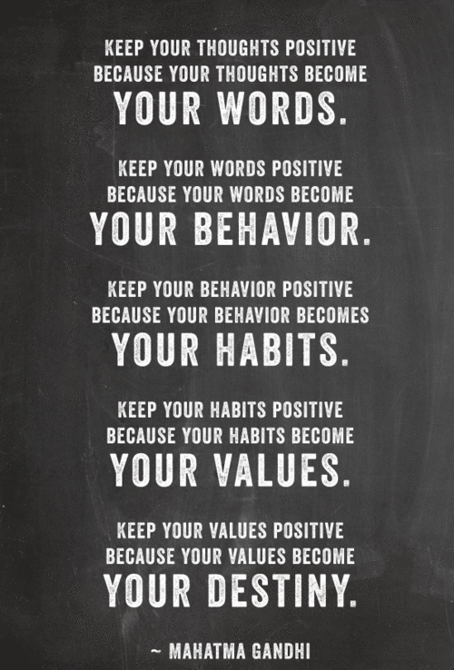

#1. 思维模式的重要性

<!--   -->

在第10节课（公司文化和团队建设）里，[Alfred Lin](http://en.wikipedia.org/wiki/Alfred_Lin)引用了甘地语录：

> “Your beliefs become your thoughts, your thoughts become your words, your words become your actions, your actions become your habits, your habits become your values, your values become your destiny.” 

> “信仰决定思想，思想决定语言，语言决定行动，行动决定习惯，习惯决定价值，价值决定命运。”

这段话我们都听说过很多次吧？有多少人真的理解、真的相信，甚至对之笃信呢？

凡事可能都有正负两面，一个人的思考模式决定他更关注哪一面。

很多人倾向于简单粗暴地把思维模式分为两种：正面思维（Positive Thinking）和负面思维（Negative Thinking）。这其实是很幼稚的。更为令人无奈的是，对着两个词汇的理解，在中文语境中更为扭曲，Positive Thinking被翻译成“积极思维”，Negative Thinking被翻译成“消极思维”，于是，直接造成了错觉，好像我们应该永远选择“积极思维”才是对的、好的、值得提倡的似的……[^1]

事实上，它们是两种**应该**<u>被平等对待的</u>，<u>事实上各有优劣的</u>，**应该**<u>根据实际情况恰当选择的</u>思维模式。

比如，当我们在评估“属于当下的事物”和“属于未来的事物”（或者把“事务”替换成“项目”也可以）的时候，就可能应该使用不同的思维模式，而不是“一视同仁”。

“属于当下的事物”的例子很多，比如，你想开一家传统意义上的咖啡馆。这个时候，我们<u>更可能应该</u>使用负面思维——也就是说，更多地关注这个项目的负面，而不是正面。为什么呢？因为这样一个项目的正面已经被证明为可行了，所以，我们要关注焦点更多地放在负面上。

但是，反过来，如果一个项目是属于未来的，那么我们选择正面思维<u>更划算</u>，因为属于未来的东西必定不是完美的，而就算这个东西成功，它将来也再次必然被另外一个不那么完美，但肯定当前这个强很多的东西所替代。如果我们只关注它的负面，结论很明显——它无论从哪个角度看都是“荒唐不经”的。[^2]

请注意措辞，我两次都是用了“更”——因为我们并不认为每次都要“选择这个就不用那个”、“选择那个就绝不用这个”，这只是两种思维模式，我们要根据实际情况选择重点在哪里。

	
Peter Thiel在第五节课最后的问答环节中，轻描淡写地、比较委婉地表达了对Lean Startup[^3]方法论的不屑——这也是观众争议比较多的地方。事实上，在Zero To One里Peter Thiel就直接多了，他认为在Lean Startup的方法论根本无法完成“零的突破”。

在这里我们能更清楚地看到思维模式的不同直接导致的不同观点和不同选择。

Lean Startup方法论的信奉者，骨子里都是“未来不可知论者”，他们认为绝不应该自以为是，于是，他们的选择是

> * 一切都需要验证
> * 从最简单最直接的事情开始做起
> * 快速迭代

而从另外一个角度，向Peter Thiel这种人，基于种种原因所谓的“未来”在他眼中是更为清晰的——于是选择自然不同。

最有趣的事情是，人倾向于“自我证明”。两个可能对立的方法论在使用的过程中，都可能产生各种“意外的好运”（所谓的“[Serendipity](http://en.wikipedia.org/wiki/Serendipity)”），不过，几乎无一例外的是，人们都会把这种其实跟方法论无关的意外好运归功于正在笃信的方法论，于是，我们最常看到的是“一条路走到黑”。

有些人好像从基因里就倾向于成为一个未来不可知论者。

> The future you shall know when it has come; before then, forget it.

>  --- *Aeschylus*

可实际上，人的每一种能力都是有可能成长的，差别只不过是 1) 是否选择中止；2) 能有多快的速度。而对于未来的预知能力也一样。没有人从一开始就有，但随着成长，我们终究会获得一定的预知未来的能力，有的人进步得快，有的人进步得慢，有人能走得更远，有人注定走不了多远……

从这一点上来看我也认为只相信Lean Startup方法论是危险的[^4]，因为这样其实等于从自己身上砍掉了一个很有潜力的发展机会。

20节课中，每个讲者都有独特的思维模式，从他们的观点中可以窥探端倪，但更有趣的是这些人所共同持有的一些思维模式。最好的学习方法就是在复习这些课程的时候，在脑子中多问自己几个问题：

* 这个人最根本上笃信的是什么？乃至于他现在有这样的观点？
* 这个观点跟谁的相同？根源一致吗？
* 这个观点跟谁的不同？为什么？
* 我处于什么阶段，乃至于我不大可能得到相同的结论？
* ……(请自行补充)

很多人是勤于学习的，但却好像并无成长。个中的原因很多，其中一个是因为他们长期以来只想找一个“放之四海皆准的原则”——因为这个就省心了，以为以后只要如此这般照着做就一定会成功。可问题在于，放之四海皆准的道理不是没有，但确实少之又少，人生短暂，世事难料，于是，时时刻刻都需要“实际情况实际分析”……

学会并习惯“**实际情况实际分析**”确实是很难的事情，因为学会了这个，就等于学会了独立思考，这是只有万分之一的人最终能够掌握的技能。

<!--

“听说”、“知道”，和“理解”、“相信”、“笃信”都不是一回事儿，很多非常重要的道理虽然显而易见，却绝对不是每个人都对之笃信的。

是否你曾有过这样的闪念：

> ——为什么那些道理人人都在分享，却没几个人真的当回事儿？

> ——为什么这些道理我明明都知道，却一而再再而三地犯同样的错误？

“听说”、“知道”，和“理解”、“相信”、“笃信”都不是一回事儿，很多非常重要的道理虽然显而易见，却绝对不是每个人都对之笃信的。这就是为什么大多数人最终言行不一的原因，也是为什么那么多人即便在有高人指导的情况下也依然无法真正改变的根本原因。

这话也在很多地方反复听过、见过很多遍吧？你真的对之笃信吗？不用对着别人回答这个问题，只要对自己诚实一点就行。

如果你并不笃信这段话，其实也就没必要继续下去了——除非你愿意尝试着重新理解它，不断地验证它，直至自己不由自主地相信它，乃至于它成为你自然而然的思考和行事的原则——即所谓的“笃信”。

笃信并不等于迷信。有意义的笃信，是建立在独立思考和践行的基础上的。之所以笃信一个道理，是因为真正理解了它的意义，也曾反复经历验证，乃至于只能笃信。

-->

[^1]: 即便在英文世界里，也开始有很多人反思所谓的Positive Thinking是不是被理解错了。有兴趣可以读一下这本书：[ Bright-Sided: How Positive Thinking Is Undermining America](http://www.amazon.com/Bright-Sided-Positive-Thinking-Undermining-America/dp/B0054U577C)

[^2]: 在2011年初我开始了解比特币的时候，我的判断是这是属于未来的东西，它必然不完美，但相对于现有的体系来看，它一定是“革命”级别的东西。于是，我知道我应该选择正面思维，于是，我更多关注的它的正面，而非负面。

[^3]: 把“Lean Startup”翻译成“精益创业”其实也是过分误导的。我其实也想不出什么样的翻译更好（这从一个侧面说明了批评显然更为容易），当然从另外一个角度来看，“能直接使用另外一个语言”远比必须“等翻译”轻松得多。

[^4]: 注意“只”这个字。
