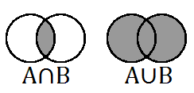

#隐喻与类比——为什么他们都很擅长用这些东西？

第五课里，Peter Thiel借用概率论里的概念去描述那些不同大小的公司如何展现自己：

大公司说，“We are in the union of A & B so we are actually” to appear small”（如左图所示）

小公司说，“Small firm — “We intersect the niche markets of A & B” to prop themselves up”（如右图所示）

