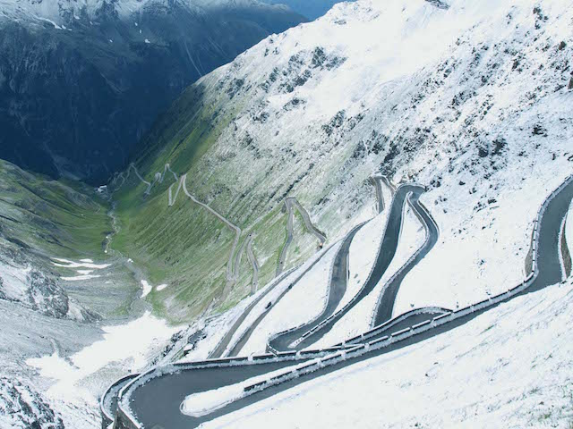

#如何避免出师未捷身先死

创业是一个漫长的过程——远比想象得漫长，只有走到尽头回头看的时候才觉得“光景一瞬间”。

整个创业课一直在警告想要创业的人，要有远见，对未来要深度思考。到了最后一节课，Sam 再次提到 *burn out*...

>  The wrong answer is to stay in hero mode until you **burn out**. Which is what most people do.

> Take vacation. Another common thing that we see is founders will run their business for three or four years without ever taking more of a day of vacation. And that works for a year or two years or something like that. It really leads to a nasty **burn out**.

创业团队最痛苦的阶段就是在做出东西之前，需要长期玩命工作，做出一个可能被验证为失败的产品。而后的每次 pivot，其实本质上都可能是从头再来。每天工作12个小时——比别人多出一倍，一旦失败，就等于浪费了两倍的时间……个中痛苦可想而知。

很多人、很多团队，其实都是这样“出师未捷身先死”的。

谁不希望自己能有一条这样的路走呢？

可事实上，这是不自然的，大自然是这样的：

而创业某种意义上是爬山、登顶，那就更可能是这样的：

天很冷，路很滑，看不到太阳……

很多的时候，心态很重要，而良好的心态常常来自于提前准备好的耐心。

有个比较好玩的例子：

> 医学院里的学生，在学习如何检视 X 光片的时候，一开始几乎无需“练习”正确率就可自然达到80%以上。

> 但这不够，作为职业医生，要做到95%以上，当然最好100%。于是，他们要每天看很多张，做很多甄别。

> 经过一段时间的练习之后，期中考试，学生们会痛苦地发现自己的正确率事实上降低了……甚至还不如之前完全没有练习过的时候——比如正确率可能是65%。

> 这是正常现象。**因为已习得的知识其实增加了甄别的难度**：有的看起来是问题，但实际上并不是问题；有的看起来不是问题，但实际上是严重问题……

> 再经过一段痛苦的挣扎，到了期末考试的时候，大家的正确率开始回升，直至专业水平。

而医学院里的老师，则常常拿这个过程当作教学工具，时常提醒学生们回顾当时的情形，以便对当前的困难有清楚的认识，也对未来的前景有更现实理智的判断。

有了预先准备好的耐心，就可能有比别人更好的心态。

创业也一样，走出去就回不来…… 那句玩笑话是怎么说的来着？前途是光明的，道路是曲折的。

