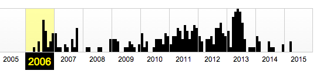
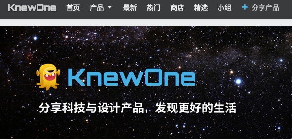

#做一个有灵魂的产品

第七课也许是我最喜欢的一节了——有很多可以、值得挖掘的亮点。

主讲人是YC第二期的学生，而后创建了一个叫 [WuFoo] (http://www.wufoo.com/)的表单提交网站。那是2006年，他们总计拿了11万8千美元，最后在2011年卖给了Survey Monkey，投资回报率高达29,561%——近300倍。

看着这个课程，我想起来2011年的时候，网上突然出现了一批做在线表表单生成的网站……现在也都不知道怎样了。

在这节课之后，我在网上搜着玩，找到了一个中国网站——[问卷星](http://sojump.com)。在archive.org上看了看[它的历史](https://web.archive.org/web/*/http://sojump.com)，竟然发现这家中国的做问卷调查的网站，其实比wufoo.com创建得早多了……

这倒给了我们一个很好的样本去比较两个做的事情看起来差不多，但最终天壤之别的公司。

其实这不再是产品的事儿了，而是做人的事儿。有些人就是比另外一些人更有所谓灵气。好像从很小的时候这种差异就会出现。有的人就是很好玩，天天不知道哪儿冒出来那么多好玩、可爱的主意。我身边有很多朋友都是这样的，最夸张的一位是给自己家里的每一样东西都取名字的人……

他们做出来的东西，就是招人喜欢的，而且是毫不客气地招人喜欢——往那儿一放，就是有人喜欢。

我一度以为这是天生的气质，但最终发现这种东西也是可以习得的——因为我自己天生不是这种人，有一点这样的本事，也绝对是后天练出来的。

只不过练的方法其实很简单：只要经常花时间去多琢磨一个简单的问题就行。每次做完东西之后（build something），都要问自：

> “如果这还是个木头人，我要给他注入灵魂，那我应该干什么？”

这种问题也许在很多人眼里是无聊的罢，但就是因为不停地问这种看起来很傻的问题，所以我后来经常能“在平淡之处显惊雷”——虽然很多都是“暗例子”，不太好举例，但倒是有个长久公开的样本：[knewone.com](http://knewone.com)。

如果访问[knewone](http://knewone.com)的网站，你不妨把鼠标停留在knewone小怪物的图标上，你会发现它在不停地颤动……然后有一行字出来：

> KnewOne，根本停不下来~

这是后来的版本了，最初的时候，还没有这个动画。由于沙昕哲、李路和我都不懂所谓的设计，担心自己的网站上线之后太难看，于是，我们花了很久的时间在网上搜索，后来买了一套某阿根廷人设计的图标，然后，设计成这样：

* 网站有100+个Logo，
* 每次访问网站的时候，就随机显示一个

然后就有用户连续刷新了不知道多久，最终得出个结论：

> knewone总共有122个Logo！

做个用户喜爱的产品，除了大家都知道的道理之外，我认为还有另外一个特别关键的点：

> 你作为创造者，你自己就要做一个“招人喜欢的人”，“有趣的人”

——当然，从更高层面来讲，“无论如何，都要做一个有灵魂的人”。

