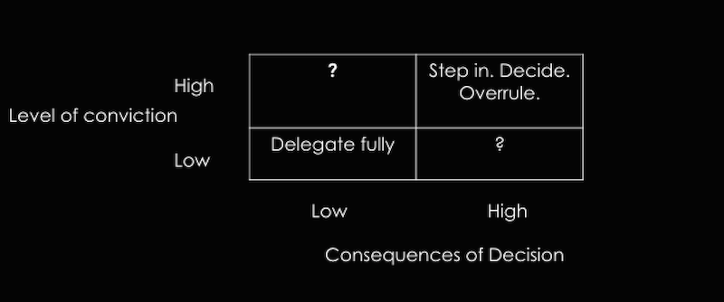

#那些略微没那么简单的事

绝大多数人为了刷存在感，喜欢复杂的知识和结构，与此同时常常连最简单的道理都没有能力遵循——比如，都知道坚持的必要却从未坚持过，再比如，都知道循序渐进是必须的却总是想一蹴而就。

很多有用的道理，因简单而困难。

仔细观察一下就知道，那些把简单本身叠加起来而构成的没那么简单的东西，其实已经远远超出绝大多数人的理解、应用范围了。

速度是个非常简单的概念，加速度只不过是把速度这个简单的概念重复叠加了一遍而已。还记得有多少人在高中被它难倒吧？

利率其实是个更简单的概念，复利只不过是把利率这个简单的概念重复叠加了一遍，就够成了绝大多数人一辈子都已为自己已经理解却从未认真应用过的东西。显而易见地，他们拒绝承认身边少数“一年三百六十五天，每天进步一点点”的人跟原地踏步的自己有任何差别和距离。

二分法，有多难呢？没多难。可是，叠加使用就是需要学和练的了。

也许很多人听到 Keith Rabois 说这是 Peter Thiel 教他的思考方法，以为他在谦虚，但我更倾向于认为他是认真的，因为这样简单的手段，确实常常给我们很多极为有用的结论。

#### 要选择什么样的事情做？（《高效能人士的七个习惯》）

|         |  重要的  | 不重要的 |
| ------- |:-------:| -------:|
| 紧急的   |    *    |         |
| 不紧急的 |         |         ||

#### 为什么要做一些不喜欢做的事情？（《[把时间当做朋友](zhibimo.com/read/xiaolai/ba-shi-jian-dang-zuo-peng-you/index.html)》）

|         |  有趣的  |  无趣的  |
| ------- |:-------:| -------:|
|  有用的  |         |    *    |
|  无用的  |         |        ||

#### [Unknown Unknown](http://en.wikipedia.org/wiki/There_are_known_knowns)

|         |  known  | unknown |
| ------- |:-------:| -------:|
| known   |         |         |
| unknown |         |    *    |

提过 two by two matrix 之后没多久，Keith Rabois 又提到另外一个没那么简单的事情： **One important concept is pairing indicators.**

> ... Which is, if you measure one thing and only one thing, the company tends not to optimize to that. And often at the expense of something that is important. Cost is example of payments and financial services is risk. It's really easy to give the risk team the objective and say, we want to lower our fraud rate. It sounds great. Until they start treating every user in this audience as a suspect because they want to lower the fraud rate. So they require each of you to call them up on the phone and give them more supplemental information and fax in things. Then you have the lowest fraud rate in the world, you also have the lowest level of customer satisfaction score.

所谓的“运营”，就是[打造一个引擎](framework-of-thinking-operating-vs-editing.html)之后不断优化的过程。而所谓的优化，最关键的就是不断监控、调整各种指标。Rabois 的忠告是，“千万不要孤立地对待某个指标”。只看一个指标、只根据一个指标进行优化很简单，但这不行，得“没那么简单一点点”（或者说“稍微复杂一点点”）：要把相关的指标放在一起考虑…… 说起来轻巧做起来难，这个忠告的理解应用难度比“复利的理解应用”高太多了。

关于“千万不要孤立地对待某个指标”，今天（2015年5月6日）多了一个好例子。《钛媒体》今天登了一篇文章，“[一个曾以天涯为傲又离开的老员工讲述天涯16年](http://www.tmtpost.com/231879.html)”：

>> ... 第三次高潮：2010年10月5日极品女“小月月”事件由天涯发端。三周时间，其原帖点击量已超过4600万次，网友回复达到10万5千余条。另外，有关“小月月”的衍生品：贴吧、小组、论坛、插图应运而生。甚至，有网友成立了 “拜月一族”，“拜月神教”。“小月月”刷新了雷人记录，把奥利奥、香蕉皮等都给搞坏了。

> 为了生存，拉客谁都可以理解，但你不能跑到大街上去拉。然而，为了流量、为了眼球，类似的帖子却一再地被天涯作为主导内容在最显眼的地方进行推荐。确实，这样的帖子可以带来大量的眼球，但从另一个角度而言，宝马汽车会在你的平台上投放广告吗？周大福会吗？？奥利奥会吗？？？

> 错失了客户，机会就不等你了。

流量是个重要的指标，甚至可能确实是最重要的指标，但，如果不是**高质量的流量**，那是不是不仅无益甚至有害了呢？这真不是随便想想就行的事情，真的是不在意就会付出惨重代价的事情。