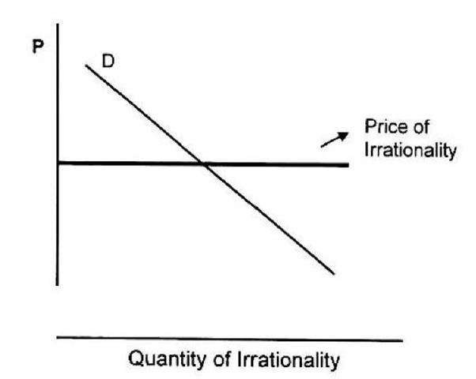

#理性之非理性

管理为什么那么难？第十四课里，Keith Rabois 指出了根本原因：

> Basic reason is people are irrational.

如若每个人真的像宏观经济学教材（或博弈论教材）里所说的那样都是“理性的个体”，那么，几乎所有的组织都不需要管理了，只需要最基本的、合理的章程，而后每个人“依法办事”就行了。

可事实上呢？人们都是非理性的。

不过，这个解释并不能让人透彻地明白真实的机理。2001年，经济学家 Bryan Caplan 提出了一个概念，“ 理性之非理性”（Rational Irrationality），用来解释一个为什么生活中（尤其是政治和宗教领域）有那么普遍的非理性行为存在——理论上每个个体都应该是理性的，可事实看起来又与之相悖。（参见Brayn Caplan 的书，*[The Myth of the Rational Voter: Why Democracies Choose Bad Policies](http://www.amazon.com/The-Myth-Rational-Voter-Democracies/dp/0691138737)*。这本书的评分不高，但这也是合情合理的，不是吗？）

按照经济学理论，Caplan 认为非理性也是符合供应需求曲线理论的。当非理性行为成本变低的时候，其需求就会相应地变高。当错误的成本实际趋近于零之时，非理性行为的需求就无限高。

而事实上，当一个非理性行为构成的错误成本很低的时候（不一定要“事实上成本很低”，只要“感觉上成本很低”就够了），人们就会放松对自己的要求，不在意自己是否是理性的了，这就解释了为什么很多人不那么笨，但却常常犯逻辑错误，常常被感知偏见说影响，或常常被情绪所左右。同时，这也解释了为什么很多“受过良好教育”的人依然对星座之类的东西津津乐道——犯错就犯错呗，没啥成本，人畜无害，至少感觉上如此。

进入二十一世纪，心理学几乎成了最重要的学科之一，它的发展，让我们反复重新认识这个世界。一个管理者必须时时刻刻注意更新自己的心理学知识，这对沟通与管理都有重要的影响。

如若我们清楚地了解“理性之非理性”这个概念，我们就可能很容易理解那些可能令我们恼火的事件，也可能会因此更容易找到更有效的解决方案。如若你在工作中发现团队成员有不理性的行为，第一件要做的事情可能不是去训斥他们，或者批评这种行为，而是去想，是不是这种行为的成本太低了造成的？如果是，不需要批评，不需要训斥，只需要想办法提高那个成本就可以了。

另外一个与之相关，也更有趣的概念是“[Public Choice Theory](http://en.wikipedia.org/wiki/Public_choice_theory)”，有兴趣的话，不放去看看。

