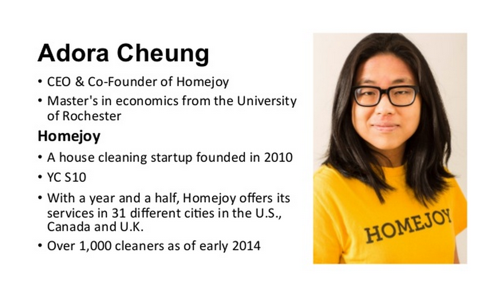
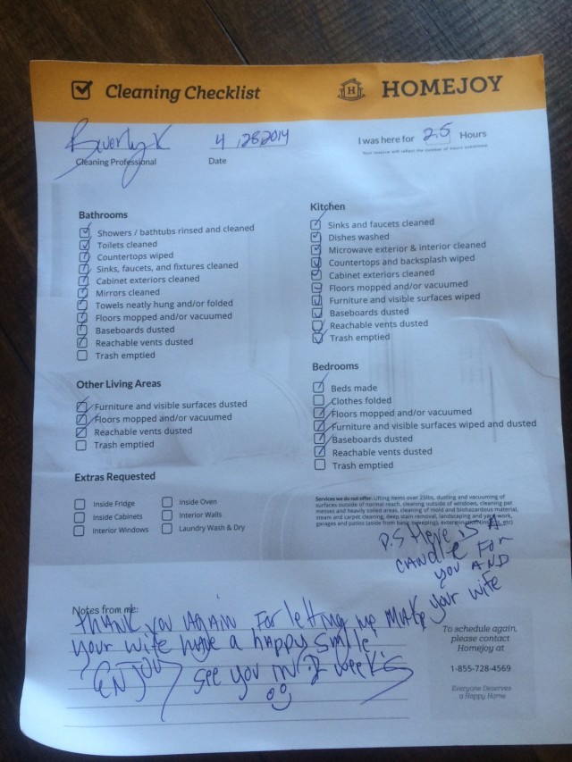

#现实：大多创业团队需要转型

第四课是我最喜欢的几节课之一。当然，由于[Adora Cheung](https://twitter.com/nolimits)并不是一个广为人知的大神级人物，他们兄妹俩的项目[Homejoy](https://www.homejoy.com/)在国内也名声寥寥，于是很多人表示这节课没啥意思，“干货不多”……

“人不可貌相”从来都是很久很久以后的“后话”，在那之前，人人都“以貌取人”[^1]。

也许是我当过很久老师的缘故吧，在我眼里，Cheung基本上属于“[一眼望过去就知道是好学生](learn-anything-you-can-learn.html)”的那种人。

大学里明显不会有关于家庭清洁服务的课程，但这根本拦不住他们。

> * 直接应聘去清洁公司上班，买各种可以买得到的书去看，有培训班就马上去参加……

> * 研究一切可以找得到的关于这个领域内其它公司的资料，把搜索引擎上可以找的资料前1000条全都读一遍……要是上市公司的话，就直接去查找S1文件……

> * 公司还小的时候，不可能像Facebook一样有个Growth Team，那么就靠自己来，一切都手动，不要自动——因为自动会有遗漏，且有可能浮于表面……

> * 公司大了，有钱了，也不是直接烧钱打网络广告，而是罗列一切可能的渠道，而后一个一个地尝试。一次只试验一个渠道，失败了，就退回分支，去尝试另外一个选择——直至遍历所有可能性……

这种做法一看就是好学生在学校里练出来的基本素质：**认真、仔细、不怕麻烦**。

最干的干货来了：

> 这是我们的第13个项目。

也就是说，这样聪明且勤奋的兄弟俩也是失败了12次才终于做对了一次。

我见过很多团队，他们东施效颦地信奉一些教条：

* 我们是一个有信仰的团队。
* 我们坚信这个方向是绝对没有问题的。
* 我们只是需要坚持、坚持、再坚持……

事实可能并非如此——虽然说不清楚“事实就是如此”究竟有多大的可能性……

虽然第一节课里Sam说，最好从一开始就想清楚——嗯，最好。

虽然第五节课里Peter Thiel对Lean Startup的创业方法论嗤之以鼻——嗯，他今年多少岁？Adora Cheung今年多大？

但，绝大多数创业者可能最终就是这样的。

* 最初的所谓创见被证明不甚了了；
* 最初也有人看好，但那又如何？

Adora Cheung是在2010年被YC投资的——具体数额未披露——但直到2012年Homejoy才开始运营…… 这两年里竟然12次转型，除了佩服他们的韧性之外，也不得不承认这样一点：靠谱的创见，不是说有就有的。

- 什么时候应该转型？没有标准答案。
- 什么时候应该继续坚持？没有标准答案。

有一点倒是可以值得参考，就是成长速度快不快？不快，那就要小心了。（即便这个参考建议还是不确定的……）

这是HomeJoy的一个调查表样本

这里有一篇关于HomeJoy的报道：[From failure to $37M funding with Adora Cheung – Homejoy](http://wpcurve.com/homejoy-adora-cheung/)

[^1]: 这真的不是段子：当年我去新东方应聘的时候，竟然被评价“长得不像老师”……于是只好跑出去搞了一副眼镜……后来真的近视了，打台球的水平都几乎退化没了。

