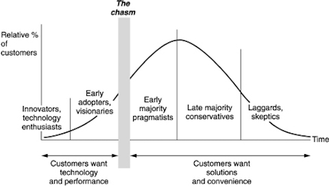
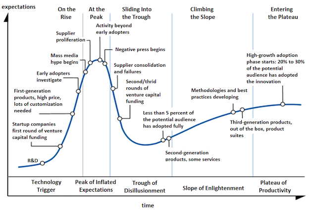

#举一反三是所有聪明人必备的能力

在第十九课里，Tyler Bosmeny 有一段话：

> Prospecting is the process of figuring out who will even take your call. There's this guy at Everett Rogers who has created a technology life cycle adoption curve. He describes it as a bell curve where you have innovators who will try new things, early adopters, mid-stage adopters, late adopters, and laggers. One of the things that was really helpful for me in understanding sales at an early start up is he's quantified the tail of this bell curve. This part over here are innovators, those are your potential customers. It might seem discouraging that only 2.5 percent of companies are your potential customers or would even consider buying from a startup that has no users and no revenue, but I found the opposite. I found it extremely helpful to have this frame of mind because when only 2.5 percent of companies will even take your call or consider using your product, you realize what a numbers game this becomes. If you want to reach that 2.5 percent and you want to get some early sales, you're hopefully starting to realize you have to do a lot of calling. You have to talk to a lot of people.

[举一反三](http://web.archive.org/web/20100519092401/http://www.lixiaolai.com/index.php/archives/4758.html)的能力很重要。

> 《论语·述而》：“举一隅，不以三隅反，则不复也。”

训练自己这方面的能力，其实只需要不断问自己一句话就可以了：

> 那……这个道理还可运用在什么地方？

事实上，举一反三也是一种[类比能力](why-they-are-deft-at-making-analogies.html)。

大多数人是匮乏于这种能力的。在反复看创业课的整个过程中，我不断想起各种各样的小时候反复学过的成语典故：

> 刻舟求剑、学步邯郸、井底之蛙、东施效颦、叶公好龙、一叶障目、水滴石穿、画蛇添足……

哪个不是创业课里反复强调的东西呢？小时候学过，笑过，并不妨碍自己重蹈旧辙，更不妨碍自己重蹈旧辙而不自知。

与之前提到的概念“technology life cycle adoption curve”相关的是另外一个概念“[Hype Cycle](http://en.wikipedia.org/wiki/Hype_cycle)”:

学一个新的概念之后，不妨再反复问自己：

> 那……这个概念（道理）还可运用在什么地方呢？

