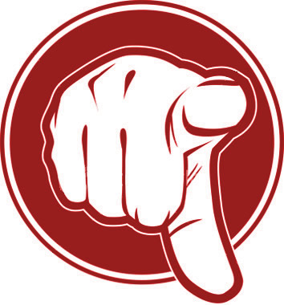

#销售必须亲自来

总体上来看，YC 创业课上是不提倡做好产品之前就考虑营销的，甚至反复告诫，[营销是创业中最不重要的事情](who-needs-marketing.html)……结果，在几乎最后一课（第二十课是总结）里，着重讲了销售。

这看起来稍微有点矛盾，但其实并没有。YC 的这套创业课程是强方法论课程，却与此同时又[不是“职业培训课程”](this-is-not-a-vocational-course.html)，“实际情况实际分析”是贯穿始终的原则。

做好产品，[把产品做到最好，最被需要，最被热爱](make-a-product-that-has-a-soul.html)，是最本质、最强大的销售。[精通你的用户](becoming-the-expert-of-your-own-users.html)，是最强大的销售工具。我从心底里认同这些基本的方法论。

以下是我在2007年10月8日写的[博客文章](http://web.archive.org/web/20100519092401/http://www.lixiaolai.com/index.php/archives/159.html)：

###销售的境界
by xiaolai on 2007/10/08 in 随便想想

大学毕业之后做的第一件事儿就是销售。销售是很神奇的一种工作——你不创造，但却可以获得价值。于是，很快沉迷于这个工作之中。拿着一样东西，管它是什么，就把它卖出去，换成真金白银，然后再买更多的东西去卖。有很多人跟你一样卖同样的东西，但你卖的比别人多，为什么？因为顾客信你的，不信别人的，或者是更信你的。三寸不烂之舌有的时候很重要，有的时候一点儿用都没有；随机应变或许可以增加更多的利润，也可能瞬间让你好不容易获取的信任消失殆尽。终于有一天，我明白，原来我之所以卖得比别人贵，还比别人多，是因为我在销售梦想。人买一样东西，往往是为了满足心愿。而人们所谓的某个心愿其实就是他所拥有的梦想的某一部分之体现。于是，我整天在揣摩每个人的梦想是什么，因为，如果你知道一个人的梦想是什么，你总是可以找到能够满足他的产品或者产品的某项功能。于是，我卖得更好，好到其他同行只能望我项背唏嘘汗颜之地步……

突然，从某一天开始，我不再因为我能卖得贵还卖得多而荣。我开始腻歪这件事儿：面对一个人，倾听他的每一个言词之间的隐含信息；判断他的每个可能的欲望；然后用各种手段告诉他，花钱买我的东西的理由；或者干脆让他自己想出花钱买我的东西的理由……我不喜欢，越来越不喜欢。因为，我突然发现，某种程度上，这就好像一个体格健壮的人去欺负一个身体瘦弱的人——只不过，我的“肌肉”是健壮的思维。尽管我可以安慰自己，我卖的东西本身确实是好的——这是事实，但是，我依然觉得自己的这个技能非常没劲，并且，只要我自己一不留神，就可能被自己滥用。与此同时，我的销售技能却无视我情愿与否飞速提高。最初我只是面对某个顾客进行销售，然后就是销售给一群人，再后是培训复制一批跟我一样能销售的人，他们再把东西卖给更多的人……

我退休了。（当然也是因为另外一个更重要的原因——父亲大病。）再后来，我去了一个民办机构做老师。六年，我不再因为我的销售能力收钱——起码不直接销售，不直接收钱。我的课针对的是英语考试，科目是阅读和作文，可是最终，还是发现我在销售一个梦想——听众想出国，听众想与众不同。我想只讲英语，只讲作文，可是听众不允许，他们会用低分惩罚我。可是，如果非要逼我销售梦想，谁能做得过我呢？我咬了咬牙，对自己说，好吧，满足你们。谁让我需要钱呢。不过还好，就像我刚刚说的，我不用直接收钱这件事儿多少可以使我心境平和一些。于是，我挣扎着做一件事情：主要卖知识，为了保障学生评价最高（其实是为了自保）适当卖些梦想。但是，“人人都会成功”这类的鬼话我坚决不讲，倒是“永不轻言放弃”在某些时候确实有道理……

我又退休了。可我也得做些什么。某一天，乔布斯在他的介绍iphone的一次讲演中一下子击中了我。他面对观众，左手从裤袋里拿出iphone，然后缓慢地把手臂伸直，把掌中的iphone展示给大家，一言不发。精美的设计，使观众掌声雷鸣。等掌声结束之后，乔布斯又做了一个动作，把手中的垂直方向的iphone转成水平方向；观众们看到的是iphone的靓丽屏幕上的画面自动旋转了90度——掌声雷鸣。乔布斯依然没有说话，等掌声平息之后，他的右手伸出两根手指，在iphone的屏上捏了一下，那画面竟然随着手指在屏幕上的滑动缩小了！——掌声雷鸣，哨声不断。他又把那两根手指展开，画面又展开了！——观众们已经彻底疯狂了，更长时间的雷鸣掌声……

好多年来我在想却不是很容易表述出来的东西，现在我可以一下子说清楚了。乔布斯是卓越的销售，于是他做的事情与其他的销售做的完全不同。大多数销售做的事情就是这个：买进来东西，然后再以更高一点的价格卖出去。当然，这之中有一些是优秀的销售，他们做的是比别人卖得多，卖得贵。卓越的销售与前其他销售不一样，这些卓越的销售不在“说服”他人上浪费任何时间，这些卓越的销售把时间精力花在去寻找甚至制造需求，真正的需求，然后做出一个谁都需要的谁都喜欢的产品或者服务；而后只需要做一件事情：展示。

> Do your homework. 

这是我在英文中读到的最有用的句子。道理全都是一样的。买股票前，do your homework，买入之后就可以不管了；写文章之前，do your homework，想清楚了之后，照写出来就完了；销售之前，do your homework，找到真正有用的产品或者服务，展示就可以了。

Tyler Bosmeny 的说法几乎是如出一辙：

> They're doing everything they can to find out what this person needs and hopefully understand their problem even better than they do. That's what really great sales is.

然而，即便是你做出了一个很好的东西，也不是每个人都可以像乔布斯一样站在台上展示一下所有人就都跟着疯狂了。很可能你还是要退回原点，想尽一切办法去说服他人。

这活不好干。很多创业者的解决方案如出一辙：找个“销售专家”——这是最典型的“回避困难”（   [见《把时间当作朋友》第三章](http://zhibimo.com/read/xiaolai/ba-shi-jian-dang-zuo-peng-you/Chapter3.html)）——把最难的事情交给别人看，妄图让困难、困境自动消失，从来都是弱者一贯的选择。

第十九课里，Tyler Bosmeny 说，

> What I've learned is that when it comes to "hiring the sales people," as a founder, the reality is that it's you.

对啊，你是创始人，你不干谁干？你不会谁会？必须你干，只能你干，没有其它选项，也没有任何借口。

