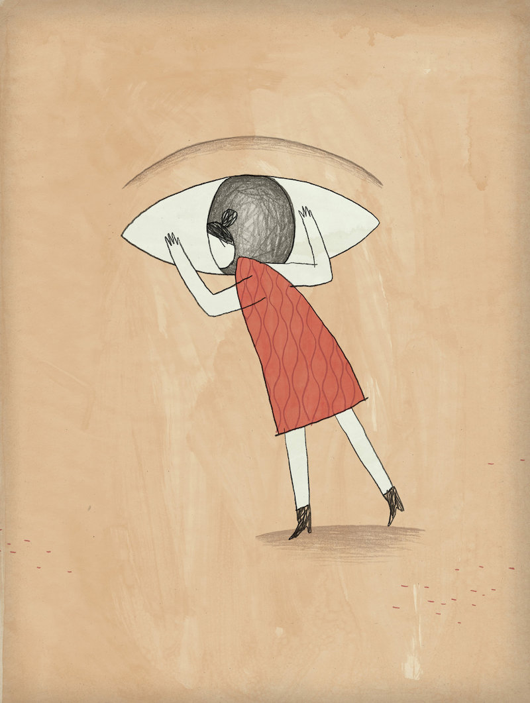

#穿过表象看本质

第十六课里，Emmett Shear 分享如何做好用户调查 (User Interview)，本质上来看，就是在说“如何做出一个用户真正需要的产品”，以用户反馈作为产品开发的驱动力。

某种意义上，这节课是 Paul 的一个观点（[精通你的用户](becoming-the-expert-of-your-own-users.html)）的详细论述。

Shear 的观点和大多数成功的产品经理一样，第一步就是“最好做[自己就是用户的产品](should-you-better-start-from-solving-your-own-problems.html)”，因为这样从一开始就起码有一个真实用户。

由于“自己”只不过是一个人，所以肯定不够，于是要想尽一切办法跟更多的用户打交道，不仅要与更多的用户打交道，更关键的点在于“要跟更多的关键用户打交道”。

其实这并不是什么“高级技巧”：一切的思考质量都来自于思考者是否能够做到“穿过表象看到实质”。

Shear 举的例子是，在 Twitch 这个平台上，关键用户是那些直播者，那些自己玩游戏给别人看的人。这些用户相对于那些只看不玩的人对 Twitch 来说更重要。

而接下来，Shear 关于如何向用户提问的若干“技巧”，无非都是同样的思考模式。(比如不要采取“单刀直入式的提问”……)

解决问题、探寻问题，都绝不能仅仅流于表面。崔健的《像一把刀子》里面有这样一句歌词：

> “这时我的心就像一把刀子，它要穿过你的喉咙去吻你的肺……”

解决问题的时候，我们就要用这样的态度，往往要穿过问题的喉咙去探它的肺才可以找到答案——像一把刀子。

我喜欢崔健的这个[类比](why-they-are-deft-at-making-analogies.html)。绝大多数人确实不是一把刀子，更不可能是一把锋利的刀子。只有少数人，好像有那火眼金睛，能够一下子抓住问题的本质，这是一种需要长期自我训练才能获得、才能打磨的能力。

说来说去，迂回和旁敲侧击，是做好用户调查的关键。

在这一点上，那些经常阅读心理学书籍的人可能更有体会——为了获得真实的、有价值的反馈，心理学家们费尽心机地设计各种问题。最近最好玩的一个例子是 Arthur Aron 的一篇[论文](http://psp.sagepub.com/content/23/4/363.full.pdf+html)，后来被[纽约时报报道](http://www.nytimes.com/2015/01/11/fashion/modern-love-to-fall-in-love-with-anyone-do-this.html)："*To Fall in Love With Anyone, Do This*"。Arthur Arron 设计了36个问题，任何两个条件差不多的人（哪怕是陌生人），在认真共同回答完这些问题之后，最后再对视4分钟，就会彼此坠入爱河……仔细阅读那36个问题，再仔细揣摩这些问题的作用，你就会明白这些问题设计的多么精巧。

在下一节课里（第十七课），我们可以看到更多的“深入提问”的例子：

> We ask a lot of questions. We just ask different ones. We don't ask them specific things about, do you want this or do you want that. We ask them: how do they behave? How do they live? A great example is the iPod. If you said to somebody, "If you could put a thousand songs in your pocket and take them anywhere," that's cool. Not, "Do you want a digital portable music player?"

而“重新定义”自己的行为，某种意义上也是一种“穿过表象看透实质”的例子（同样来自下一课）：

>  We think of ourselves as an experiences company.

以及：

>  Data is great, understanding is better. 

